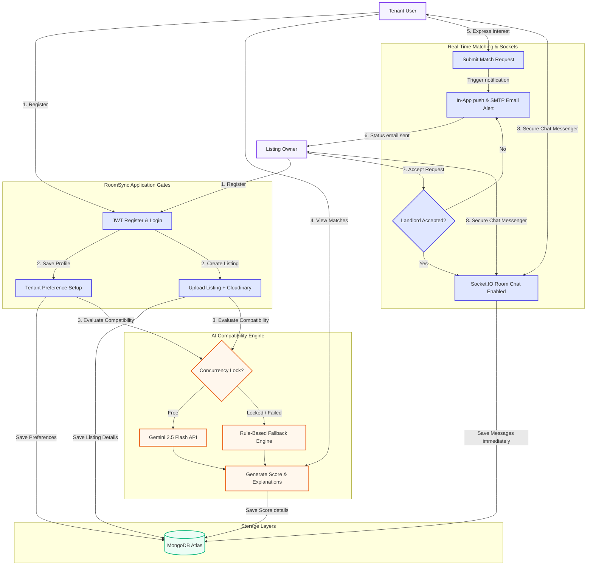

# RoomSync - Rent & Flatmate Finder (MERN Stack with Gemini AI)

RoomSync is an enterprise-grade MERN stack application designed to simplify finding apartments and compatible flatmates in Pune. The platform features role-based workflows, Gemini AI-powered compatibility matching with deterministic rule-based fallback logic, a real-time secure chat messenger, custom dynamic status tracking, and a comprehensive admin command center.

---

## 📊 End-to-End System Flow Diagram

The diagram below visualizes the complete user lifecycle, AI compatibility scoring, interest match request workflows, and real-time messaging gates:



---

## 📖 Comprehensive Project Overview

### 1. The Problem Statement
Finding matching apartments and compatible flatmates in urban hubs like Pune is traditionally fragmented. Users face mismatched budget expectations, location disputes, conflicting moving timelines, and lifestyle friction (habits, room layouts). Furthermore, initial contact channels are unsafe, letting users chat before checking match intent, leading to spam.

### 2. The Solution Overview
RoomSync provides a secure, intelligent, and real-time portal connecting flatmate searchers and listing owners. 
- It uses a **weighted AI Compatibility Scoring Engine** (powered by Gemini) with a rule-based deterministic fallback to rank listings for tenants.
- Direct messaging is **strictly locked** until a landlord accepts a tenant's interest request.
- Integrated real-time communications (Socket.IO with JWT authorization), instant notifications, and email alerts keep matching fluid and transparent.

---

## 🚀 Key Features

### 👤 Role-Based Portals & Dashboards
- **Tenants**: Express interests in listings, track application statuses, maintain preferred budgets and locations, and chat directly with landlords once accepted.
- **Owners**: Add/manage room listings with rich image attachments, review tenant profiles, evaluate compatibility scores, and trigger instant chat channels.
- **Admins**: Monitor site statistics, manage users and listings, perform bulk audit actions, search log timelines, and toggle "Live Mode" for automatic dashboard refreshes.

### 🧠 Gemini AI Compatibility Engine
- Leverages the Google Gemini Flash API (`gemini-2.5-flash`) to generate semantic compatibility percentages (0-100%) and textual explanations based on budget, move-in schedules, and locations.
- Automatically falls back to a deterministic **Rule-Based Matching Algorithm** (Budget 40%, Location 30%, Move-In Date 20%, Room Type 10%) if the AI API key is missing or rate limits are reached.

### 💬 Real-Time Messaging & Notifications
- Fully integrated WebSocket client via **Socket.IO** for instant chat message bubbles, status indicators, and typing notifications.
- **In-App Notification Center**: Real-time push alerts (bell icon dropdown in Navbar) notifying users of new messages, incoming match requests, or approval updates.
- **Auto-Read Queue**: Once a notification is clicked or bulk-marked as read, it is optimistically swept from the active dropdown view.

### 📱 Responsive & Mobile-Friendly Overhaul
- **Mobile Hamburger Menu**: Auto-populates navigation links matching the authenticated user's role privileges (Tenant vs Owner vs Admin) and collapses when clicked.
- **Collapsible Filters**: Search filters compress to a single-row text search on mobile and toggle details using a responsive Sliders drawer.
- **Form Actions & Chats**: Stacks buttons vertically on mobile for touch target accessibility, and message bubbles expand to fill `85%` of narrow screen widths.

---

## 🛠️ Tech Stack & Directory Structure

```text
RoomSync/
├── client/                     # Frontend Vite + React SPA
│   ├── public/                 # Static assets (favicons, logos)
│   └── src/
│       ├── components/         # Reusable UI widgets, Navbars & sidebars
│       ├── context/            # Global React Contexts (AuthContext)
│       ├── hooks/              # Custom react hooks (useAuth)
│       ├── layouts/            # Shared layouts (Navbar, Sidebars, AdminLayout)
│       ├── pages/              # Screen components (Dashboard, ChatsPage, AdminDashboard)
│       ├── services/           # Api service wrappers (notificationService, adminService)
│       └── utils/              # Client-side utility functions
│
├── server/                     # Backend Express REST API
│   ├── config/                 # Cloudinary, Database, and Socket setups
│   ├── controllers/            # Request handlers (authController, notificationController)
│   ├── middleware/             # Route authentication, error handlers, and async wrappers
│   ├── models/                 # Mongoose collection schemas (User, Listing, Chat)
│   ├── routes/                 # Express route entrypoints
│   ├── services/               # Core business logic layer (compatibilityService, interestService)
│   ├── socket/                 # Socket.IO connection event registers
│   └── utils/                  # Helper routines (generateToken)
```

---

## 📖 Detailed Project Documentation Portal

All detailed project documentation, API maps, setup manuals, and database specifications are organized in the **[`documentation/`](file:///d:/Unthinkable%20Ass/documentation)** directory:

### 🚀 Getting Started & Local Launch
- **[Installation & Local Setup Guide](file:///d:/Unthinkable%20Ass/documentation/setup-guide.md)**: Local developer requirements, environment details, and quickstart commands.
- **[Testing & Scenarios Manual](file:///d:/Unthinkable%20Ass/documentation/testing-guide.md)**: Testing scenarios for authentication, listings, chats, and SMTP mails.
- **[Deployment Manual](file:///d:/Unthinkable%20Ass/documentation/deployment-guide.md)**: Production deployment instructions for MongoDB Atlas, Render, and Vercel.

### 🧠 System Architecture & Design
- **[Architecture Specification](file:///d:/Unthinkable%20Ass/documentation/architecture.md)**: Multi-layer system architecture and tech stack details.
- **[System Design Brief](file:///d:/Unthinkable%20Ass/documentation/system-design.md)**: Design summaries of compatibility scoring, fallback handling, chat, and database integrity.
- **[Database Schema & Indexes](file:///d:/Unthinkable%20Ass/documentation/database-schema.md)**: Field mappings, validation constraints, and query indices.
- **[RESTful API Documentation](file:///d:/Unthinkable%20Ass/documentation/api-documentation.md)**: Request body parameters list, controller actions, and endpoint schemas.

---

## ⚙️ Quick Local Installation Summary

### 1. Server Configuration
```bash
cd server
npm install
# Seed initial listings, dummy users, and tenant profiles
npm run seed
npm run dev
```

### 2. Client Configuration
```bash
cd client
npm install
npm run dev
```

---

## ⚖️ License
Licensed under the [ISC License](file:///d:/Unthinkable%20Ass/LICENSE). All rights reserved.