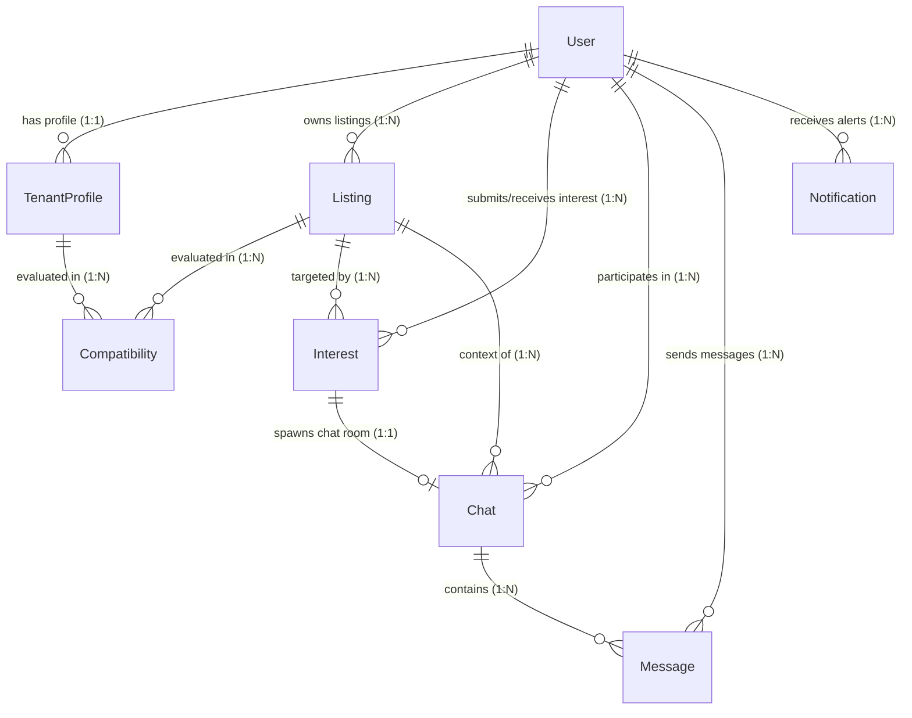

# MongoDB Database Schema & ER Model

This document outlines RoomSync's database structure, validations, indexes, and entity relationships.

---

## 📊 Entity-Relationship (ER) Diagram

---

## 🗂️ Collections Specifications

### 1. `users` Collection
Stores accounts credentials and authorization roles.

- **Fields**:
  - `name` (String, Required, Min length: 2, Max: 120, Trimmed)
  - `email` (String, Required, Unique, Lowercase, Trimmed, validated by regex)
  - `password` (String, Required, Min length: 8, Select: false)
  - `role` (String, Enum: `['tenant', 'owner', 'admin']`, Default: `tenant`)
  - `isActive` (Boolean, Default: `true`)
  - `avatar` (String, Default: `""`)
  - `lastLoginAt` (Date, Default: `null`)
- **Indexes**:
  - `{ email: 1 }` (Unique)
  - `{ role: 1, createdAt: -1 }` (Admin listings optimization)

---

### 2. `listings` Collection
Room listings published by owners.

- **Fields**:
  - `owner` (ObjectId, Required, Ref: `User`)
  - `title` (String, Required, Max: 150, Trimmed)
  - `description` (String, Required, Max: 5000, Trimmed)
  - `location` (String, Required, Trimmed)
  - `rent` (Number, Required, Positive)
  - `roomType` (String, Required, Enum: `['private-room', 'shared-room', 'studio', 'apartment', 'other']`)
  - `furnished` (Boolean, Default: `false`)
  - `amenities` (Array[String], Default: `[]`)
  - `images` (Array[Object], contains `url` and `publicId`)
  - `isActive` (Boolean, Default: `true`)
  - `status` (String, Enum: `['active', 'filled']`, Default: `active`)
- **Indexes**:
  - `{ owner: 1 }` (Dashboard retrieval)
  - `{ rent: 1, location: 1 }` (Tenant marketplace filter searches)

---

### 3. `tenantprofiles` Collection
Profiles storing tenant roommate preferences.

- **Fields**:
  - `user` (ObjectId, Required, Ref: `User`, Unique)
  - `preferredLocations` (Array[String], Default: `[]`, Indexed)
  - `budgetRange` (Object: `min` (Number, positive), `max` (Number, positive), `currency` (String, default: `INR`))
  - `moveInDate` (Date, Required, Indexed)
  - `roomPreferences` (Array[String])
  - `lifestylePreferences` (Array[String])
  - `bio` (String, Trimmed, Max: 1000)
  - `gender` (String, Enum: `['male', 'female', 'other']`, default: `other`)
  - `isSearching` (Boolean, Default: `true`)

---

### 4. `compatibilities` Collection
Evaluated compatibility scores.

- **Fields**:
  - `listingId` / `listing` (ObjectId, Ref: `Listing`, Required)
  - `tenantId` / `tenantProfile` (ObjectId, Ref: `User` / `TenantProfile`, Required)
  - `score` (Number, Min: 0, Max: 100)
  - `explanation` (String)
  - `strengths` (Array[String])
  - `weaknesses` (Array[String])
  - `scoringBreakdown` (Object: `budgetScore`, `locationScore`, `dateScore`, `roomTypeScore`)
  - `scoringMethod` (String, Enum: `['LLM', 'Rule-Based']`)
  - `llmProvider` (String, e.g. `'Gemini'`)

---

### 5. `interests` Collection
Expressions of match interest requests.

- **Fields**:
  - `tenant` (ObjectId, Ref: `User`, Required)
  - `listing` (ObjectId, Ref: `Listing`, Required)
  - `owner` (ObjectId, Ref: `User`, Required)
  - `status` (String, Enum: `['pending', 'accepted', 'declined']`, Default: `pending`)
  - `tenantMessage` (String, Max: 1500)
  - `ownerResponseMessage` (String, Max: 1500)

---

### 6. `chats` Collection
Active chat conversations containers.

- **Fields**:
  - `listing` (ObjectId, Ref: `Listing`, Required)
  - `tenant` (ObjectId, Ref: `User`, Required)
  - `owner` (ObjectId, Ref: `User`, Required)
  - `interest` (ObjectId, Ref: `Interest`, Required, Unique)
  - `lastMessage` (ObjectId, Ref: `Message`)
  - `lastMessageAt` (Date)

---

### 7. `messages` Collection
Persistent chat messages.

- **Fields**:
  - `chatId` / `chat` (ObjectId, Ref: `Chat`, Required)
  - `senderId` / `sender` (ObjectId, Ref: `User`, Required)
  - `receiverId` (ObjectId, Ref: `User`, Required)
  - `listingId` (ObjectId, Ref: `Listing`, Required)
  - `message` / `content` (String, Required)
  - `messageType` (String, Enum: `['text', 'image', 'system']`, Default: `text`)
  - `timestamp` (Date, Default: Date.now)
  - `replyTo` (ObjectId, Ref: `Message`)

---

### 8. `notifications` Collection
Notifications.

- **Fields**:
  - `recipient` / `receiver` (ObjectId, Ref: `User`, Required)
  - `sender` (ObjectId, Ref: `User`)
  - `type` (String, Enum: `['interest_received', 'interest_accepted', 'interest_declined', 'new_message']`)
  - `title` (String, Required)
  - `content` / `message` (String, Required)
  - `isRead` (Boolean, Default: `false`)
  - `link` (String)
