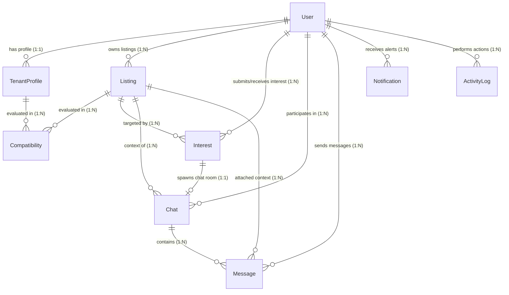

# RoomSync Database Schema

This document details the MongoDB database schema structures mapped using Mongoose, including collections, references, indexes, and an Entity-Relationship (ER) model.

---

## Entity-Relationship (ER) Diagram

Below is the database relationship mapping showing how users, profiles, room listings, chats, and interest requests are interconnected.

---

## Collection Schemas

### 1. `users` Collection
Stores credential accounts and access control roles.

| Field | Type | Attributes | Description |
| :--- | :--- | :--- | :--- |
| `_id` | ObjectId | Auto-generated, Primary Key | Unique user identifier. |
| `name` | String | Required, Min length: 2, Max: 120 | Full name of the user. |
| `email` | String | Required, Unique, Lowercase, Trimmed | Contact email address (login credential). |
| `password` | String | Required, Select: false | BCrypt-hashed password. Excluded from standard queries. |
| `role` | String | Enum: `['tenant', 'owner', 'admin']`, Default: `tenant` | System roles to authorize API portals. |
| `avatar` | String | Default: `""` | HTTPS URL to the profile picture. |
| `isActive` | Boolean | Default: `true` | Status of the account (can be blocked by Admin). |
| `lastLoginAt` | Date | Default: `null` | Timestamp of the user's last login. |
| `createdAt` | Date | Auto-populated | Record initialization timestamp. |
| `updatedAt` | Date | Auto-populated | Record modification timestamp. |

- **Indexes**:
  - `{ email: 1 }` (Unique)
  - `{ role: 1, createdAt: -1 }` (Admin query optimization)

---

### 2. `tenantprofiles` Collection
Stores tenant compatibility preferences.

| Field | Type | Attributes | Description |
| :--- | :--- | :--- | :--- |
| `user` | ObjectId | Required, Unique, Ref: `User` | User reference. |
| `preferredLocations` | Array[String] | Required (min: 1) | Target Pune locations. |
| `budgetRange.min` | Number | Required, Min: 0 | Bottom threshold rent budget. |
| `budgetRange.max` | Number | Required, Min: 0 | Maximum limit rent budget. |
| `budgetRange.currency`| String | Default: `INR` | Rent currency. |
| `moveInDate` | Date | Required | Target lease starting date. |
| `roomPreferences` | Array[String] | Default: `[]` | Room layout preferences. |
| `lifestylePreferences`| Array[String] | Default: `[]` | Life habits tags. |
| `bio` | String | Max length: 1000 | Custom user introduction. |
| `gender` | String | Required, Enum: `['male', 'female', 'other']` | Gender. |
| `isSearching` | Boolean | Default: `true` | Search status. |

---

### 3. `listings` Collection
Room listings published by landlords.

| Field | Type | Attributes | Description |
| :--- | :--- | :--- | :--- |
| `owner` | ObjectId | Required, Ref: `User` | Landlord identifier. |
| `title` | String | Required, Max: 150 | Headline of the listing. |
| `description` | String | Required, Max: 5000 | Detailed room description. |
| `location` | String | Required | Area neighborhood. |
| `rent` | Number | Required, Min: 0 | Monthly rent amount. |
| `roomType` | String | Required, Enum: `['private-room', 'shared-room', 'studio', 'apartment', 'other']` | Room configuration. |
| `furnished` | Boolean | Default: `false` | Furnishing status. |
| `amenities` | Array[String] | Default: `[]` | Included benefits. |
| `images` | Array[Object] | Default: `[]` | Images meta. |
| `isActive` | Boolean | Default: `true` | Visibility toggle. |
| `status` | String | Enum: `['active', 'filled']`, Default: `active` | Progress state. |

---

### 4. `compatibilities` Collection
Evaluated compatibility score metrics of room listings vs tenant preferences.

| Field | Type | Attributes | Description |
| :--- | :--- | :--- | :--- |
| `listing` | ObjectId | Required, Ref: `Listing` | Legacy Listing ref. |
| `tenantProfile` | ObjectId | Required, Ref: `TenantProfile` | Legacy TenantProfile ref. |
| `listingId` | ObjectId | Required, Ref: `Listing` | Listing ID identifier. |
| `tenantId` | ObjectId | Required, Ref: `User` | User ID of the tenant. |
| `score` | Number | Required, Min: 0, Max: 100 | Overall match score. |
| `explanation` | String | Required | Structured text summary. |
| `strengths` | Array[String] | Default: `[]` | Detailed matching points. |
| `weaknesses` | Array[String] | Default: `[]` | Areas of friction. |
| `scoringBreakdown` | Object | Sub-fields: `budgetScore` (0-40), `locationScore` (0-30), `dateScore` (0-20), `roomTypeScore` (0-10) | Weighted categories breakdown. |
| `llmProvider` | String | Default: `null` | Evaluator platform (e.g. `"Gemini"`). |
| `scoringMethod` | String | Enum: `['LLM', 'Rule-Based']` | Scoring engine used. |

- **Indexes**:
  - `{ listing: 1, tenantProfile: 1 }` (Unique)
  - `{ listingId: 1, tenantId: 1 }` (Unique)
  - `{ tenantId: 1, score: -1 }` (Highest score search indexing)

---

### 5. `interests` Collection
Expressions of match requests between flatmate searchers.

| Field | Type | Attributes | Description |
| :--- | :--- | :--- | :--- |
| `tenant` | ObjectId | Required, Ref: `User` | Sender user. |
| `listing` | ObjectId | Required, Ref: `Listing` | Room listing context. |
| `owner` | ObjectId | Required, Ref: `User` | Receiving landlord. |
| `status` | String | Enum: `['pending', 'accepted', 'declined']` | Request status. |
| `tenantMessage` | String | Max: 1500 | Introduction note. |
| `ownerResponseMessage` | String | Max: 1500 | Landlord response. |

---

### 6. `chats` Collection
Contains metadata about active conversation rooms.

| Field | Type | Attributes | Description |
| :--- | :--- | :--- | :--- |
| `listing` | ObjectId | Required, Ref: `Listing` | Room context. |
| `tenant` | ObjectId | Required, Ref: `User` | Tenant participant. |
| `owner` | ObjectId | Required, Ref: `User` | Landlord participant. |
| `interest` | ObjectId | Required, Unique, Ref: `Interest` | Linked accepted interest request. |
| `lastMessage` | ObjectId | Ref: `Message` | Pointer to the newest message. |
| `lastMessageAt` | Date | Index | Newest message timestamp. |

---

### 7. `messages` Collection
Stores persistent conversation bubbles sent in chat rooms.

| Field | Type | Attributes | Description |
| :--- | :--- | :--- | :--- |
| `chat` | ObjectId | Required, Ref: `Chat` | Legacy Chat room container. |
| `sender` | ObjectId | Required, Ref: `User` | Legacy Message sender. |
| `content` | String | Required | Legacy content string. |
| `chatId` | ObjectId | Required, Ref: `Chat` | Chat room identifier. |
| `senderId` | ObjectId | Required, Ref: `User` | Author user ID. |
| `receiverId` | ObjectId | Required, Ref: `User` | Recipient user ID. |
| `listingId` | ObjectId | Required, Ref: `Listing` | Room listing context. |
| `message` | String | Required | Message text content. |
| `messageType` | String | Enum: `['text', 'image', 'system']`, Default: `text` | Content type classifier. |
| `timestamp` | Date | Default: `Date.now`, Index | Delivery timestamp. |
| `replyTo` | ObjectId | Ref: `Message`, Default: `null` | Quote reference message ID. |
