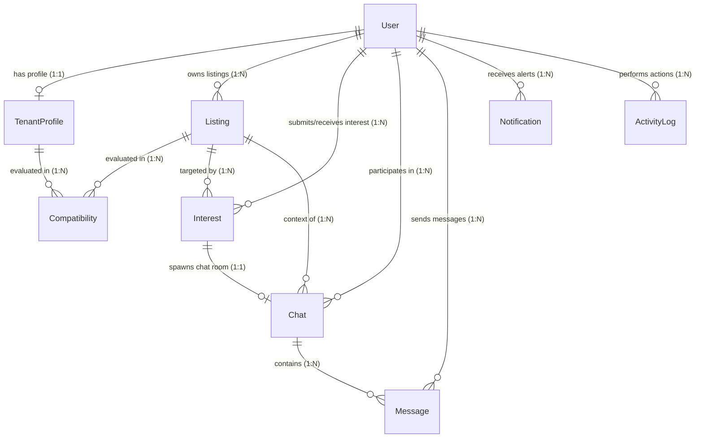

# RoomSync Database Schema

This document details the MongoDB database schema structures mapped using Mongoose, including collections, references, indexes, and an Entity-Relationship (ER) model.

---

## Entity-Relationship (ER) Diagram

Below is the database relationship mapping showing how users, profiles, room listings, chats, and interest requests are interconnected.

---

## Collection Schemas

### 1. `users` Collection
Stores credential accounts and access control roles.

| Field | Type | Attributes | Description |
| :--- | :--- | :--- | :--- |
| `_id` | ObjectId | Auto-generated, Primary Key | Unique user identifier. |
| `name` | String | Required, Min length: 2, Max: 120 | Full name of the user. |
| `email` | String | Required, Unique, Lowercase, Trimmed | Contact email address (login credential). |
| `password` | String | Required, Select: false | BCrypt-hashed password. Excluded from standard queries. |
| `role` | String | Enum: `['tenant', 'owner', 'admin']`, Default: `tenant` | System roles to authorize API portals. |
| `avatar` | String | Default: `""` | HTTPS URL to the profile picture. |
| `isActive` | Boolean | Default: `true` | Status of the account (can be blocked by Admin). |
| `lastLoginAt` | Date | Default: `null` | Timestamp of the user's last login. |
| `createdAt` | Date | Auto-populated | Record initialization timestamp. |
| `updatedAt` | Date | Auto-populated | Record modification timestamp. |

- **Indexes**:
  - `{ email: 1 }` (Unique)
  - `{ role: 1, createdAt: -1 }` (Admin query optimization)

---

### 2. `tenantprofiles` Collection
Stores tenant compatibility preferences.

| Field | Type | Attributes | Description |
| :--- | :--- | :--- | :--- |
| `user` | ObjectId | Required, Unique, Ref: `User` | User reference. |
| `preferredLocations` | Array[String] | Required (min: 1) | Target neighborhoods the tenant is searching in. |
| `budgetRange.min` | Number | Required, Min: 0 | Bottom threshold rent budget. |
| `budgetRange.max` | Number | Required, Min: 0 | Maximum limit rent budget. |
| `budgetRange.currency`| String | Default: `USD` | Rent currency. |
| `moveInDate` | Date | Required | Target lease starting date. |
| `roomPreferences` | Array[String] | Default: `[]` | Room layout features (e.g. `studio`, `private-room`). |
| `lifestylePreferences`| Array[String] | Default: `[]` | Life rules (e.g. `non-smoker`, `vegetarian`). |
| `bio` | String | Max length: 1000 | Custom user introduction. |
| `gender` | String | Required, Enum: `['male', 'female', 'other']` | Gender specification. |
| `isSearching` | Boolean | Default: `true` | Search status toggle. |

- **Indexes**:
  - `{ user: 1 }` (Unique)
  - `{ moveInDate: 1, isSearching: 1 }` (Optimization for matching loops)
  - `{ preferredLocations: 1 }` (Location indexing)

---

### 3. `listings` Collection
Room listings published by landlords.

| Field | Type | Attributes | Description |
| :--- | :--- | :--- | :--- |
| `owner` | ObjectId | Required, Ref: `User` | Landlord/Owner identification reference. |
| `title` | String | Required, Max: 150 | Search headline for the room listing. |
| `description` | String | Required, Max: 5000 | In-depth property description. |
| `location` | String | Required | Neighborhood/address in Pune. |
| `rent` | Number | Required, Min: 0 | Monthly rent amount. |
| `roomType` | String | Required, Enum: `['private-room', 'shared-room', 'studio', 'apartment', 'other']` | Room configuration. |
| `genderPreference` | String | Enum: `['any', 'male', 'female', 'non-binary', 'couple']` | Targeted roommate gender. |
| `furnished` | Boolean | Default: `false` | Furnishing status. |
| `amenities` | Array[String] | Default: `[]` | Included benefits (e.g., `wifi`, `ac`, `parking`). |
| `images` | Array[Object] | Default: `[]` | Image metadata containing `url` and `publicId` from Cloudinary. |
| `isActive` | Boolean | Default: `true` | Visibility toggle. |
| `status` | String | Enum: `['active', 'filled']`, Default: `active` | Listing progress state. |
| `compatibilitySummary`| Object | Sub-fields: `topScore` (Num), `topExplanation` (Str), `evaluatedAt` (Date) | Summary calculations stored for index optimizations. |

- **Indexes**:
  - `{ owner: 1, createdAt: -1 }` (Owner dashboard loading)
  - `{ location: 1, rent: 1, availableFrom: 1 }` (Search filters query optimization)
  - `{ title: 'text', description: 'text', location: 'text' }` (Text indexes to support wildcard search bars)

---

### 4. `compatibilities` Collection
Calculated alignment ratings for listings against tenant profiles.

| Field | Type | Attributes | Description |
| :--- | :--- | :--- | :--- |
| `listing` | ObjectId | Required, Ref: `Listing` | Associated Listing. |
| `tenantProfile` | ObjectId | Required, Ref: `TenantProfile` | Associated Tenant Profile. |
| `score` | Number | Required, Min: 0, Max: 100 | Final compatibility score percentage. |
| `explanation` | String | Required, Max: 4000 | Explanatory statement summarizing match. |
| `source` | String | Enum: `['ai', 'rule-based']` | Calculation origin logic. |
| `evaluatedAt` | Date | Default: `Date.now` | Calculation timestamp. |

- **Indexes**:
  - `{ listing: 1, tenantProfile: 1 }` (Unique compound index)
  - `{ tenantProfile: 1, score: -1 }` (Retrieving highest scored rooms for tenant)
  - `{ listing: 1, score: -1 }` (Retrieving highest scored prospects for landlord)

---

### 5. `interests` Collection
Expression of match requests between flatmate searchers.

| Field | Type | Attributes | Description |
| :--- | :--- | :--- | :--- |
| `tenant` | ObjectId | Required, Ref: `User` | Request sender. |
| `listing` | ObjectId | Required, Ref: `Listing` | Targeted room post. |
| `owner` | ObjectId | Required, Ref: `User` | Landlord receiving the request. |
| `status` | String | Enum: `['pending', 'accepted', 'declined']` | Match status tracking. |
| `tenantMessage` | String | Max: 1500 | Initial introduction note. |
| `ownerResponseMessage` | String | Max: 1500 | Landlord response comments. |
| `respondedAt` | Date | Default: `null` | Response action timestamp. |

- **Indexes**:
  - `{ tenant: 1, listing: 1 }` (Unique - prevents multiple requests for the same room)
  - `{ owner: 1, status: 1, createdAt: -1 }` (Owner request feed filters)
  - `{ tenant: 1, status: 1, createdAt: -1 }` (Tenant request feed filters)

---

### 6. `chats` & `messages` Collections
Stores text communication history.

#### `chats`
| Field | Type | Attributes | Description |
| :--- | :--- | :--- | :--- |
| `listing` | ObjectId | Required, Ref: `Listing` | Thread listing context. |
| `tenant` | ObjectId | Required, Ref: `User` | Tenant participant. |
| `owner` | ObjectId | Required, Ref: `User` | Landlord participant. |
| `interest` | ObjectId | Required, Unique, Ref: `Interest` | Linked interest request ID that unlocked the chat. |
| `lastMessage` | ObjectId | Ref: `Message`, Default: `null` | Reference pointer to the newest message. |
| `lastMessageAt` | Date | Default: `null` | Newest message timestamp. |
| `tenantArchived` | Boolean | Default: `false` | Archive toggle. |
| `ownerArchived` | Boolean | Default: `false` | Archive toggle. |

- **Indexes**:
  - `{ tenant: 1, owner: 1, listing: 1 }` (Unique compound index)
  - `{ owner: 1, lastMessageAt: -1 }` (Inbox list loading optimization)
  - `{ tenant: 1, lastMessageAt: -1 }` (Inbox list loading optimization)

#### `messages`
| Field | Type | Attributes | Description |
| :--- | :--- | :--- | :--- |
| `chat` | ObjectId | Required, Ref: `Chat` | Chat room container. |
| `sender` | ObjectId | Required, Ref: `User` | Message author. |
| `content` | String | Required, Max: 4000 | Text payload. |
| `readBy` | Array[ObjectId] | Ref: `User`, Default: `[]` | Users who read the message. |
| `deliveredAt` | Date | Default: `Date.now` | Socket delivery timestamp. |
| `replyTo` | ObjectId | Ref: `Message`, Default: `null` | Message context reference. |

- **Indexes**:
  - `{ chat: 1, createdAt: 1 }` (Loads conversation logs sequentially)
  - `{ sender: 1, createdAt: -1 }` (Retrieves sender logs)

---

### 7. `notifications` Collection
Alert structures for in-app push indicators.

| Field | Type | Attributes | Description |
| :--- | :--- | :--- | :--- |
| `recipient` | ObjectId | Required, Ref: `User` | Targeted alert receiver. |
| `sender` | ObjectId | Ref: `User` | Alert trigger originator user. |
| `type` | String | Enum: `['interest_received', 'interest_accepted', 'interest_declined', 'new_message']` | Notification event type. |
| `title` | String | Required | Notification title. |
| `content` | String | Required | Detailed alert content string. |
| `isRead` | Boolean | Default: `false` | Read status tracking. |
| `link` | String | Optional | Navigation URL link target. |

- **Indexes**:
  - `{ recipient: 1, isRead: 1, createdAt: -1 }` (Optimizes navbar dropdown loading)

---

### 8. `activitylogs` Collection
Audit trails logged for admin analytics.

| Field | Type | Attributes | Description |
| :--- | :--- | :--- | :--- |
| `action` | String | Required | Executed event (e.g. `USER_LOGIN`, `LISTING_CREATED`). |
| `user` | ObjectId | Ref: `User` | Responsible user (null if system-triggered). |
| `description` | String | Required, Max: 2000 | Detailed description of the action. |

- **Indexes**:
  - `{ createdAt: -1 }` (Audit log timeline retrieval)
  - `{ action: 1, createdAt: -1 }` (Filter optimization)
