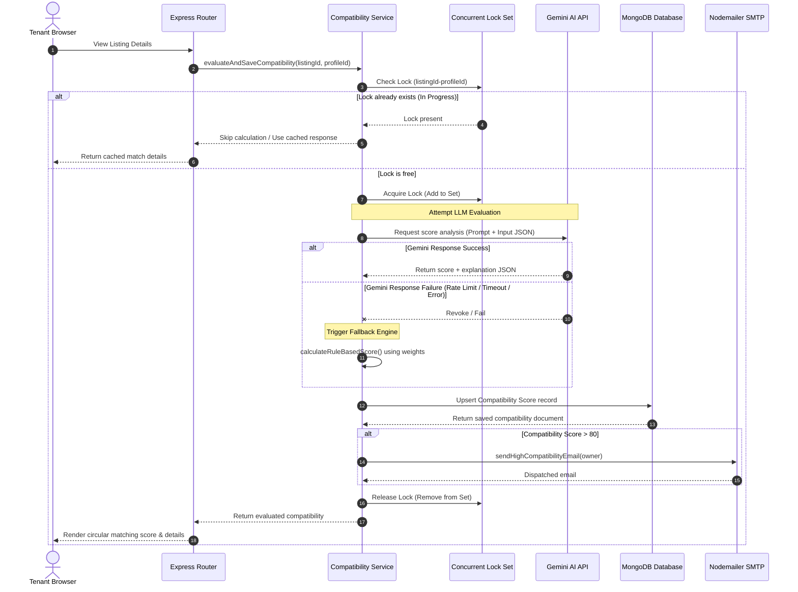

# Diagram: AI Scoring Sequence & Fallback Flow

This sequence diagram visualizes how compatibility is evaluated between a tenant profile and a listing, showing lock checking, Gemini calculations, and rule-based fallback execution.

