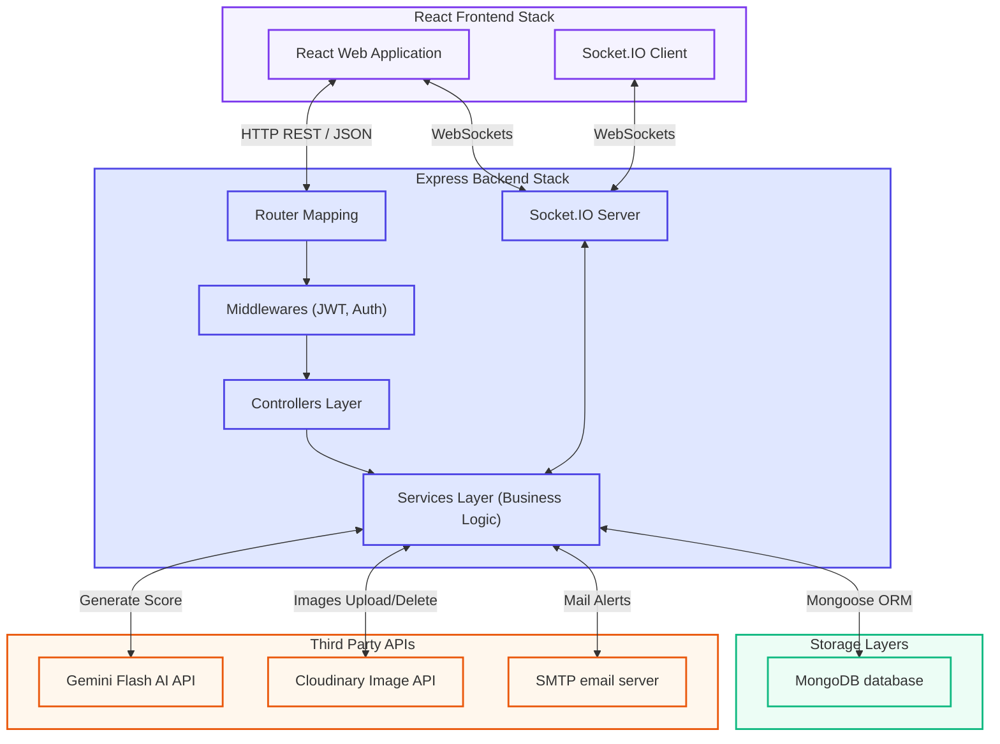

# Diagram: High-Level Architecture

This diagram visualizes RoomSync's overall system architecture, component stack, and external integration points.

```mermaid
graph TD
    %% Styling Configuration
    classDef client fill:#f5f3ff,stroke:#7c3aed,stroke-width:2px;
    classDef server fill:#e0e7ff,stroke:#4f46e5,stroke-width:2px;
    classDef db fill:#ecfdf5,stroke:#10b981,stroke-width:2px;
    classDef external fill:#fff7ed,stroke:#ea580c,stroke-width:2px;

    %% Components
    subgraph Client [React Frontend Stack]
        UI["React Web Application"]
        SC["Socket.IO Client"]
    end

    subgraph API [Express Backend Stack]
        Routes["Router Mapping"]
        Middle["Middlewares (JWT, Auth)"]
        Controllers["Controllers Layer"]
        Services["Services Layer (Business Logic)"]
        SocketServer["Socket.IO Server"]
    end

    subgraph Database [Storage Layers]
        Mongo["MongoDB database"]
    end

    subgraph APIThird [Third Party APIs]
        Gemini["Gemini Flash AI API"]
        Cloudinary["Cloudinary Image API"]
        SMTP["SMTP email server"]
    end

    %% Flows
    UI <-->|HTTP REST / JSON| Routes
    UI <-->|WebSockets| SocketServer
    SC <-->|WebSockets| SocketServer

    Routes --> Middle
    Middle --> Controllers
    Controllers --> Services
    SocketServer <--> Services
    
    Services <-->|Mongoose ORM| Mongo
    Services <-->|Generate Score| Gemini
    Services <-->|Images Upload/Delete| Cloudinary
    Services <-->|Mail Alerts| SMTP

    %% Apply Classes
    class Client,UI,SC client;
    class API,Routes,Middle,Controllers,Services,SocketServer server;
    class Database,Mongo db;
    class APIThird,Gemini,Cloudinary,SMTP external;
```
