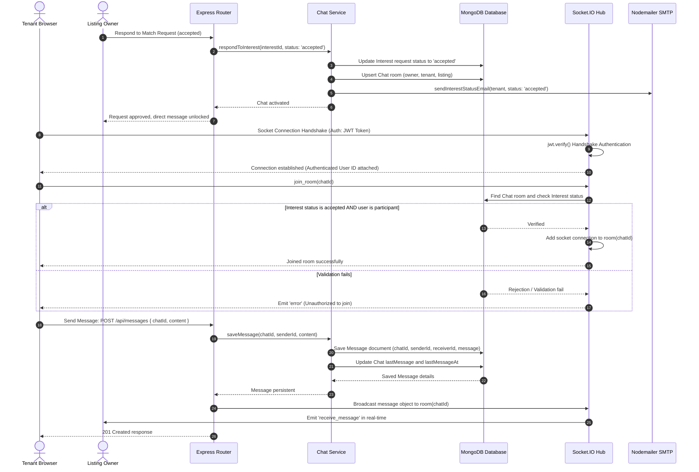

# Diagram: Chat Initialization & Messaging Sequence

This sequence diagram details the chat lifecycle: interest request acceptance, room creation, handshake validation, and real-time messaging persistence.

