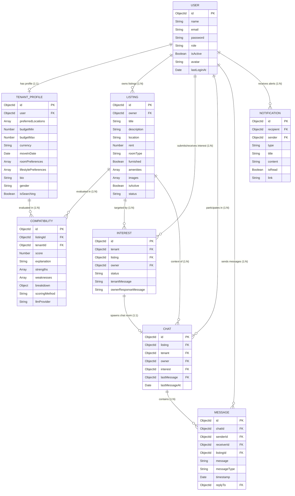

# Diagram: Database Entity-Relationship (ER) Diagram

This diagram maps the schemas and relationships of the MongoDB collections.

```mermaid
erDiagram
    USER {
        ObjectId id PK
        String name
        String email
        String password
        String role
        Boolean isActive
        String avatar
        Date lastLoginAt
    }
    TENANT_PROFILE {
        ObjectId id PK
        ObjectId user FK
        Array preferredLocations
        Number budgetMin
        Number budgetMax
        String currency
        Date moveInDate
        Array roomPreferences
        Array lifestylePreferences
        String bio
        String gender
        Boolean isSearching
    }
    LISTING {
        ObjectId id PK
        ObjectId owner FK
        String title
        String description
        String location
        Number rent
        String roomType
        Boolean furnished
        Array amenities
        Array images
        Boolean isActive
        String status
    }
    COMPATIBILITY {
        ObjectId id PK
        ObjectId listingId FK
        ObjectId tenantId FK
        Number score
        String explanation
        Array strengths
        Array weaknesses
        Object breakdown
        String scoringMethod
        String llmProvider
    }
    INTEREST {
        ObjectId id PK
        ObjectId tenant FK
        ObjectId listing FK
        ObjectId owner FK
        String status
        String tenantMessage
        String ownerResponseMessage
    }
    CHAT {
        ObjectId id PK
        ObjectId listing FK
        ObjectId tenant FK
        ObjectId owner FK
        ObjectId interest FK
        ObjectId lastMessage FK
        Date lastMessageAt
    }
    MESSAGE {
        ObjectId id PK
        ObjectId chatId FK
        ObjectId senderId FK
        ObjectId receiverId FK
        ObjectId listingId FK
        String message
        String messageType
        Date timestamp
        ObjectId replyTo FK
    }
    NOTIFICATION {
        ObjectId id PK
        ObjectId recipient FK
        ObjectId sender FK
        String type
        String title
        String content
        Boolean isRead
        String link
    }

    USER ||--o| TENANT_PROFILE : "has profile (1:1)"
    USER ||--o{ LISTING : "owns listings (1:N)"
    USER ||--o{ INTEREST : "submits/receives interest (1:N)"
    USER ||--o{ CHAT : "participates in (1:N)"
    USER ||--o{ MESSAGE : "sends messages (1:N)"
    USER ||--o{ NOTIFICATION : "receives alerts (1:N)"
    
    LISTING ||--o{ COMPATIBILITY : "evaluated in (1:N)"
    LISTING ||--o{ INTEREST : "targeted by (1:N)"
    LISTING ||--o{ CHAT : "context of (1:N)"
    
    TENANT_PROFILE ||--o{ COMPATIBILITY : "evaluated in (1:N)"
    
    INTEREST ||--o| CHAT : "spawns chat room (1:1)"
    CHAT ||--o{ MESSAGE : "contains (1:N)"
```
