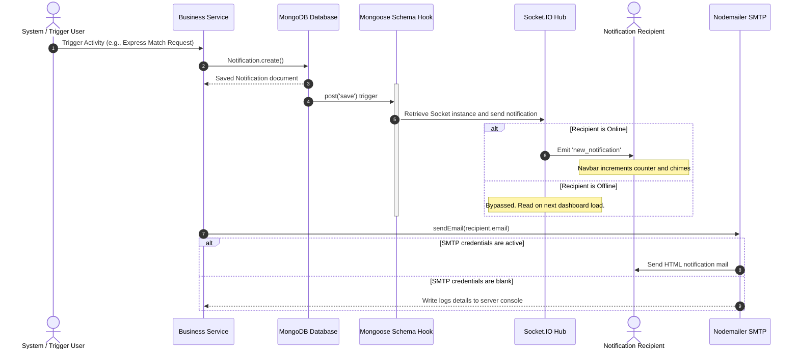

# Diagram: Notification Pipeline Flow

This sequence diagram details the notification pipeline: database insertions, socket-level overrides for in-app pushes, and concurrent email alerts.

```mermaid
sequenceDiagram
    autonumber
    actor Sender as System / Trigger User
    participant Service as Business Service
    participant DB as MongoDB Database
    participant Hook as Mongoose Schema Hook
    participant Socket as Socket.IO Hub
    actor Recipient as Notification Recipient
    participant SMTP as Nodemailer SMTP

    Sender->>Service: Trigger Activity (e.g., Express Match Request)
    Service->>DB: Notification.create()
    DB-->>Service: Saved Notification document

    %% Real-time Socket Push via Post-Save Hook
    activate Hook
    DB->>Hook: post('save') trigger
    Hook->>Socket: Retrieve Socket instance and send notification
    alt Recipient is Online
        Socket->>Recipient: Emit 'new_notification'
        Note over Recipient: Navbar increments counter and chimes
    else Recipient is Offline
        Note over Socket: Bypassed. Read on next dashboard load.
    end
    deactivate Hook

    %% Optional Email Alerts Dispatch
    Service->>SMTP: sendEmail(recipient.email)
    alt SMTP credentials are active
        SMTP->>Recipient: Send HTML notification mail
    else SMTP credentials are blank
        SMTP-->>Service: Write logs details to server console
    end
```
