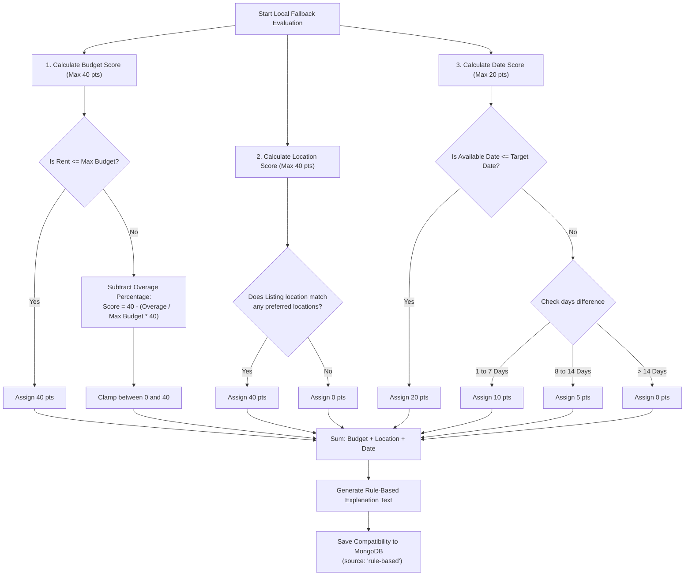

# Compatibility Fallback Flow

To ensure high availability and application resilience, RoomSync features a **Rule-Based Fallback Matching Algorithm**. If the Gemini API key is missing, network calls time out, or rate limits are reached, the system automatically defaults to a deterministic local calculation.

---

## Fallback Logic Decision Tree

The diagram below details how points are calculated locally by the fallback algorithm:

---

## Detailed Scoring Matrix

The algorithm distributes a maximum score of **100 points** across three key indicators:

### 1. Budget Match (Maximum 40 Points)
Designed to penalize expensive rentals while rewarding affordable rooms.
- **Rent falls in or below the tenant's budget range**: **40 Points**
  - Cheaper rent is counted as positive.
- **Rent exceeds maximum budget limit (`maxBudget > 0`)**:
  - The overage ratio is calculated as: `pctOverage = (rent - maxBudget) / maxBudget`
  - The penalty scales linearly: `score = Math.max(0, 40 - Math.round(pctOverage * 40))`
  - *Example*: If the user's max budget is ₹10,000, and rent is ₹12,500 (25% over budget), the score is `40 - (0.25 * 40) = 30 points`.

### 2. Location Match (Maximum 40 Points)
Performs basic case-insensitive substring scans.
- **Location match found**: **40 Points**
  - Evaluated by checking if the listing location string contains any of the tenant's preferred location strings, or vice versa (e.g. `"Koregaon Park, Pune"` matches `"Koregaon Park"`).
- **No matches**: **0 Points**

### 3. Move-in Date Match (Maximum 20 Points)
Checks availability alignments.
- **Available on or before target move-in date**: **20 Points**
- **Available 1 to 7 days after target move-in date**: **10 Points**
- **Available 8 to 14 days after target move-in date**: **5 Points**
- **Available more than 14 days after target move-in date**: **0 Points**
- **Invalid Date Input Fallback**: **20 Points** (prevents penalizing users for empty inputs).

---

## Auto-Generated Explanations

In addition to numerical scores, the fallback logic builds a narrative explanation string to display on listing cards.

### Example Generation
For a tenant with Max Budget = ₹15,000, Preferred Locations = `["Koregaon Park"]`, Target Date = `2026-08-01`.

- **Scenario A: Perfect Matching**
  - *Rent*: ₹14,000 | *Location*: `"Koregaon Park"` | *Available*: `2026-08-01`
  - *Calculated Score*: `40 (Budget) + 40 (Location) + 20 (Date) = 100%`
  - *Explanation*: `"Rule-Based Evaluation: Rent of ₹14,000 fits your budget range (up to ₹15,000). Listing location is in your preferred areas. Available on time (listed from 1/8/2026)."`

- **Scenario B: Mismatched Profile**
  - *Rent*: ₹18,000 (20% over budget) | *Location*: `"Kothrud"` | *Available*: `2026-08-05` (4 days late)
  - *Calculated Score*: `32 (Budget) + 0 (Location) + 10 (Date) = 42%`
  - *Explanation*: `"Rule-Based Evaluation: Rent of ₹18,000 exceeds your maximum budget of ₹15,000. Listing location is outside your preferred areas. Available 4 days after your target move-in date."`
