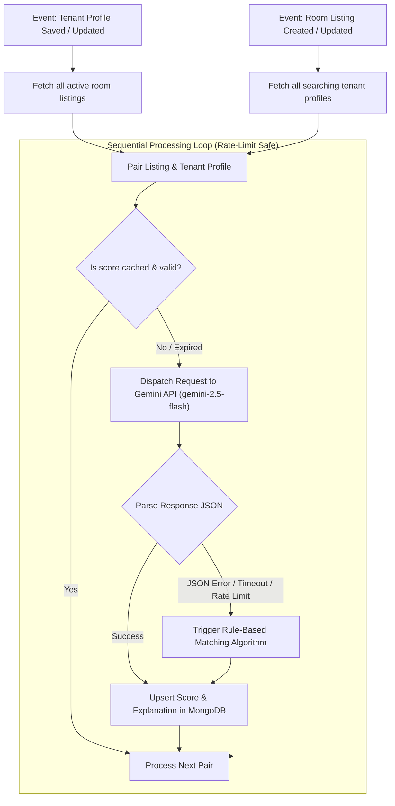

# LLM Compatibility Flow

This document details the lifecycle flow of compatibility score calculations, explaining the event triggers, the AI pipeline execution, and the database persistence logic.

---

## Process Flowchart

The diagram below illustrates how an event triggers compatibility updates, how requests are packaged, and how errors are handled via a fallback mechanism.



---

## Detailed Execution Steps

### Step 1: Event Triggering
Compatibility calculations are event-driven to avoid expensive dynamic computations during search requests. Calculations are triggered when:
- **A Tenant Profile is updated**: The tenant's budget, target move-in date, or locations list change. The system triggers `recalculateForTenantProfile()`.
- **A Listing is updated**: The landlord changes rent pricing, availability dates, or description. The system triggers `recalculateForListing()`.

### Step 2: Querying Targets
- If a tenant profile is updated, the service queries the database for all room listings where `isActive: true` and `status: 'active'`.
- If a listing is updated, the service queries all tenant profiles where `isSearching: true`.

### Step 3: Sequential Processing (Anti-Rate-Limitation)
To prevent hitting Gemini API concurrent connection ceilings and rate-limits (HTTP 429), the server iterates through matches **sequentially** using `for...of` loops and `await` instead of parallel calls (`Promise.all`).

### Step 4: The AI Pipeline
For each pair of Listing and Tenant Profile:
1. **Prompt Compilation**: The system injects data values into the pre-defined template string.
2. **API Request**: The Node.js runtime makes a POST fetch request to the Generative Language API endpoint.
3. **Strict Schema Constraints**: The payload requests a MIME type of `application/json` to compel structured output.
4. **Validation**: The backend catches syntax parsing exceptions or missing response values.

### Step 5: Persistence
The calculated score (0-100), detailed textual explanation, calculation source (`ai` or `rule-based`), and a timestamp are upserted into the `Compatibility` collection.

```javascript
const compat = await Compatibility.findOneAndUpdate(
  { listing: listingId, tenantProfile: tenantProfileId },
  {
    $set: {
      score,
      explanation,
      source,
      evaluatedAt: new Date(),
    },
  },
  { upsert: true, returnDocument: 'after' }
);
```

---

> [!TIP]  
> By keeping calculations out of the main browse queries, RoomSync can perform instantaneous sorting (`Highest Score First`) using MongoDB indexes on `{ tenantProfile: 1, score: -1 }` without incurring rendering delays.
